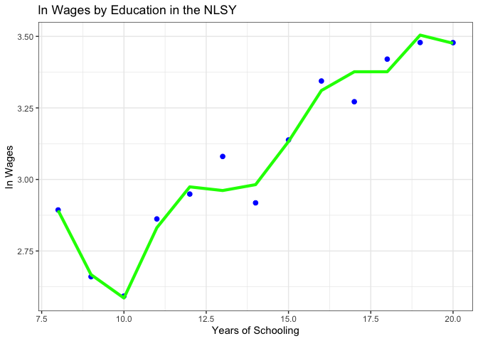
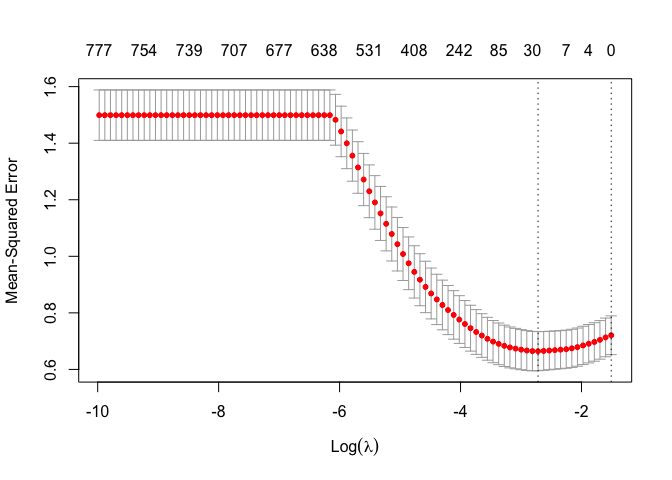

# Prediction

Outcome to be predicted: $Y_i$

> *example:* a worker’s log wage

Characteristics (aka **features**):
$X_i=\left(X_{1i},\ldots,X_{pi}\right)'$

> *example:* education, age, state of birth, parents’ education,
> cognitive ability, family background

``` r
library(tidyverse)
library(fixest)
library(glmnet)
library(patchwork)
library(caTools)
library(glue)

nlsy = read_csv('https://github.com/Mixtape-Sessions/Machine-Learning/blob/main/Labs/data/nlsy97.csv?raw=true')
```

    ## Rows: 1266 Columns: 994
    ## ── Column specification ───────────────────────────────────────────────────────────────────────────────────────────────────────────────────────────────────────
    ## Delimiter: ","
    ## dbl (994): lnw_2016, educ, black, hispanic, other, exp, afqt, mom_educ, dad_educ, yhea_100_1997, yhea_2000_1997, yhea_2100_1997, yhea_2200_1997, ysaq_284_1...
    ## 
    ## ℹ Use `spec()` to retrieve the full column specification for this data.
    ## ℹ Specify the column types or set `show_col_types = FALSE` to quiet this message.

``` r
nlsy = nlsy |>
  drop_na(educ)
```

## Least squares benchmark

``` r
# polynomial of order 10 for education
for (i in 1:10) {
  var = paste0("educ", i)

  # generate polynomials
  nlsy[[var]] = nlsy$educ^i

  # standardize our X matrix (doesn't matter for OLS, 
  # but will matter for lasso below)
  nlsy[[var]] = nlsy[[var]] |> 
    scale() |> 
    as.numeric()
}

reg = lm(
  lnw_2016 ~ educ1 + educ2 + educ3 + educ4 + educ5 + educ6 + educ7 + 
    educ8 + educ9 + educ10, 
  data = nlsy
)

nlsy$yhat= predict(reg)
```

``` r
# plot predicted values
summ = nlsy |> 
  group_by(
    educ, educ1, educ2, educ3, educ4, educ5, 
    educ6, educ7, educ8, educ9, educ10
  ) |> 
  summarize(
    mean_y = mean(lnw_2016),
    yhat_reg = mean(yhat)
  ) |> 
  ungroup()
```

    ## `summarise()` has grouped output by 'educ', 'educ1', 'educ2', 'educ3', 'educ4', 'educ5', 'educ6', 'educ7', 'educ8', 'educ9'. You can override using the
    ## `.groups` argument.

``` r
ggplot(summ) + 
  geom_point(
    aes(x = educ, y = mean_y),
    color = "blue", size = 2
  ) + 
  geom_line(
    aes(x = educ, y = yhat_reg), 
    color = "green", size = 1.5
  ) + 
  labs(
    title = "ln Wages by Education in the NLSY",
    x = "Years of Schooling",
    y = "ln Wages"
  ) +
  theme_bw()
```

<!-- -->

As we can see, least squares linear regression can approximate any
continuous function and can certainly be used for prediction. Include a
rich enough set of transformations, and OLS predictions will yield
unbiased estimates of the true ideal predictor, the conditional
expectation function. But these estimates will be quite noisy. Penalized
regression can greatly reduce the variance, at the expense of some bias.
But if the bias reduction is great enough, the predictions can have
lower MSE. Back to the whiteboard!

## Lasso in action

Welcome back! Let’s see lasso in action:

``` r
X = as.matrix(nlsy[, paste0("educ", 1:10)])
y = nlsy[["lnw_2016"]]

lasso1 = glmnet(x = X, y = y, alpha = 0.001)
lasso2 = glmnet(x = X, y = y, alpha = 0.01)

newX = as.matrix(summ[, paste0("educ", 1:10)])

# Random value of lambda [, 70]
summ$yhat_lasso1 = predict(lasso1, newx = newX)[, 70]
summ$yhat_lasso2 = predict(lasso2, newx = newX)[, 70]
```

Plot results

``` r
# Coefficient plots ------------------------------------------------------------

n <- names(reg$coefficients)
c <- reg$coefficients
p <- ggplot() +
  geom_col(
    aes(x = n, y = c)
  ) +
  coord_flip() +
  labs(y = "coef.", x = "", title = "OLS") + 
  theme_bw()

n1 <- rownames(coefficients(lasso1))
c1 <- coefficients(lasso1)[,1] |> as.numeric()
p1 <- ggplot() +
  geom_col(
    aes(x = n1, y = c1)
  ) +
  coord_flip() +
  labs(
    y = "coef.", x = "", 
    title = "LASSO with alpha = 0.001"
  ) + 
  theme_bw()

n2 <- rownames(coefficients(lasso2))
c2 <- coefficients(lasso2)[,1] |> as.numeric()
p2 <- ggplot() +
  geom_col(
    aes(x = n2, y = c2)
  ) +
  coord_flip() +
  labs(
    y = "coef.", x = "", 
    title = "LASSO with alpha = 0.01"
  ) + 
  theme_bw()


# Prediction plots -------------------------------------------------------------

f <- ggplot(summ) +
  geom_point(
    aes(x = educ1, y = mean_y),
    color = "black"
  ) +
  geom_point(
    aes(x = educ1, y = yhat_reg),
    color = "red"
  ) +
  geom_line(
    aes(x = educ1, y = yhat_reg),
    color = "red"
  ) +
  labs(
    title = "OLS",
    x = "Years of Schooling",
    y = "ln Wages"
  ) + 
  theme_bw()

# LASSO V1
f1 <- ggplot(summ) +
  geom_point(
    aes(x = educ1, y = mean_y),
    color = "black"
  ) +
  geom_point(
    aes(x = educ1, y = yhat_lasso1),
    color = "red"
  ) +
  geom_line(
    aes(x = educ1, y = yhat_lasso1),
    color = "red"
  ) +
  labs(
    title = "LASSO with alpha = 0.001",
    x = "Years of Schooling",
    y = "ln Wages"
  ) +
  theme_bw()

# LASSO V2
f2 <- ggplot(summ) +
  geom_point(
    aes(x = educ1, y = mean_y),
    color = "black"
  ) +
  geom_point(
    aes(x = educ1, y = yhat_lasso2),
    color = "red"
  ) +
  geom_line(
    aes(x = educ1, y = yhat_lasso2),
    color = "red"
  ) +
  labs(
    title = "LASSO with alpha = 0.01",
    x = "Years of Schooling",
    y = "ln Wages"
  ) +
  theme_bw()

(p + p1 + p2) / (f + f1 + f2)
```

    ## Warning: Removed 1 rows containing missing values (position_stack).

<!-- -->

Play around with different values for alpha to see how the fit changes!

### Data-driven tuning parameters: Cross-validation

Quick trip back to the whiteboard!

``` r
# Automatically does cross-validation in R
cvfit <- cv.glmnet(x = X, y = y, alpha = 1)
plot(cvfit)
```

<!-- -->

``` r
cvfit$lambda.min
```

    ## [1] 0.01375443

### Lasso-guided variable selection

For illustrative purposes we’ve been using lasso to determine the
functional form for a single underlying regressor: education. But
lasso’s real power comes in selecting among a large number of
regressors.

``` r
set.seed(123)
split <- sample.split(nlsy$lnw_2016, SplitRatio = 0.8)
training_set <- subset(nlsy, split == TRUE)
test_set <- subset(nlsy, split == FALSE)

y_train <- training_set[["lnw_2016"]]
Y_test <- test_set[["lnw_2016"]]

X_train_scaled <- training_set |> 
  select(-lnw_2016, -exp, -yhat) |>
  scale()
X_test_scaled <- test_set |> 
  select(-lnw_2016, -exp, -yhat) |>
  scale()

# deals with zero-variance cols
X_train_scaled[is.nan(X_train_scaled)] <- 0 
X_test_scaled[is.nan(X_test_scaled)] <- 0 

# TAKE OPTIMAL LAMBDA FROM CVFIT
cvfit <- cv.glmnet(x = X_train_scaled, y = y_train, alpha = 1)
plot(cvfit)
```

<!-- -->

``` r
# using minimum lambda
lasso_opt <- glmnet(x = X_train_scaled, y = y_train, alpha = 1, lambda = cvfit$lambda.min) # lambda is penalty
lasso_opt
```

    ## 
    ## Call:  glmnet(x = X_train_scaled, y = y_train, alpha = 1, lambda = cvfit$lambda.min) 
    ## 
    ##   Df %Dev  Lambda
    ## 1 25 16.2 0.06599

``` r
# y_hat
rsq_train = cor(training_set$lnw_2016, training_set$yhat)^2
rsq_test = cor(test_set$lnw_2016, test_set$yhat)^2
cat(glue("Accuracy on training set: {format(rsq_train, digits = 3)}\n"))
```

    ## Accuracy on training set: 0.078

``` r
cat(glue("Accuracy on test set: {format(rsq_test, digits = 3)}\n"))
```

    ## Accuracy on test set: 0.0645

``` r
# R^2
cor(training_set$lnw_2016, training_set$yhat)^2
```

    ## [1] 0.07797072

``` r
cor(test_set$lnw_2016, test_set$yhat)^2
```

    ## [1] 0.06451989

``` r
# coefficients
coefs_lasso = data.frame(
  var = rownames(coef(lasso_opt)), 
  coef_lasso = as.numeric(coef(lasso_opt))
)
subset(coefs_lasso, coef_lasso > 0)
```

    ##                       var   coef_lasso
    ## 1             (Intercept) 3.120161e+00
    ## 2                    educ 9.281325e-02
    ## 6                    afqt 7.321424e-02
    ## 13          ysaq_284_1997 5.368801e-03
    ## 31  youth_bothbio_01_1997 1.924901e-02
    ## 205        _BGyyhea_22_49 9.333815e-03
    ## 254        _BGyyhea_22_99 1.083995e-03
    ## 377         _BGyysaq_29a8 2.639522e-02
    ## 386         _BGyysaq_29b7 1.777412e-02
    ## 688         _BGpcv_bio_a4 1.665025e-02
    ## 726         _BGpp4_028__3 3.494874e-02
    ## 733         _BGpp4_029__3 2.709698e-16
    ## 994                 educ1 1.285207e-04

To try on your own: load the Oregon HIE data from earlier and try
lassoing the OLS regression we did there. What do you notice?

``` r
# Load Oregon HIE Data
```

## Ridge regression

First, whiteboard. Ridge is another flavor of penalized regression, like
lasso. But unlike lasso, ridge penalizes the squares (not the absolute
values) of the coefficients. As a result, ridge shrinks coefficients
toward zero, but not all the way. Let’s give it a try.

``` r
# TAKE OPTIMAL LAMBDA FROM CVFIT
cvfit <- cv.glmnet(x = X_train_scaled, y = y_train, alpha = 0)

# using minimum lambda
lasso_opt <- glmnet(x = X_train_scaled, y = y_train, alpha = 0, lambda = cvfit$lambda.min) # lambda is penalty
lasso_opt
```

    ## 
    ## Call:  glmnet(x = X_train_scaled, y = y_train, alpha = 0, lambda = cvfit$lambda.min) 
    ## 
    ##    Df  %Dev Lambda
    ## 1 915 23.31  6.447

``` r
# y_hat
training_set$yhat <- predict(lasso_opt, newx = X_train_scaled)[, 1]
test_set$yhat <- predict(lasso_opt, newx = X_test_scaled)[, 1]

# R^2
rsq_train = cor(training_set$lnw_2016, training_set$yhat)^2
rsq_test = cor(test_set$lnw_2016, test_set$yhat)^2
cat(glue("Accuracy on training set: {format(rsq_train, digits = 3)}\n"))
```

    ## Accuracy on training set: 0.33

``` r
cat(glue("Accuracy on test set: {format(rsq_test, digits = 3)}\n"))
```

    ## Accuracy on test set: 0.0613

``` r
# coefficients
coefs_ridge = data.frame(
  var = rownames(coef(lasso_opt)), 
  coef_ridge = as.numeric(coef(lasso_opt))
)
subset(coefs_ridge, coef_ridge > 0)
```

    ##                             var   coef_ridge
    ## 1                   (Intercept) 3.120161e+00
    ## 2                          educ 9.398888e-03
    ## 4                      hispanic 2.431060e-03
    ## 6                          afqt 1.241197e-02
    ## 7                      mom_educ 6.342881e-03
    ## 8                      dad_educ 5.287395e-03
    ## 10               yhea_2000_1997 5.461578e-03
    ## 12               yhea_2200_1997 2.264465e-03
    ## 13                ysaq_284_1997 5.517414e-03
    ## 14                ysaq_285_1997 4.108150e-03
    ## 15               ysaq_291a_1997 3.810691e-03
    ## 16                ysaq_292_1997 3.887021e-03
    ## 17                ysaq_293_1997 4.910309e-03
    ## 18                ysaq_294_1997 3.440369e-03
    ## 27                ysaq_373_1997 2.670999e-03
    ## 29              yinc_14700_1997 1.139532e-03
    ## 30              yinc_14800_1997 1.306651e-03
    ## 31        youth_bothbio_01_1997 4.961042e-03
    ## 33      youth_nonr1inhh_01_1997 3.893718e-03
    ## 34       youth_nonr1sex_01_1997 7.425317e-04
    ## 43                  p4_028_1997 3.912148e-03
    ## 44                  p4_029_1997 4.581823e-03
    ## 45                  p5_101_1997 3.516203e-03
    ## 51                 pc8_090_1997 4.608793e-04
    ## 55                 pc9_003_1997 2.327466e-03
    ## 59                 pc9_032_1997 4.121860e-03
    ## 60                pc12_025_1997 7.312103e-06
    ## 65      paryouth_nonr1inhh_1997 3.982325e-03
    ## 66       paryouth_nonr1sex_1997 1.717198e-03
    ## 68      paryouth_nonr2inhh_1997 8.931414e-04
    ## 70     paryouth_parentguar_1997 8.912596e-04
    ## 72   cv_bio_mom_age_child1_1997 3.146646e-03
    ## 73    cv_bio_mom_age_youth_1997 2.211570e-04
    ## 79          cv_hh_under_18_1997 9.964131e-04
    ## 81             fp_ymfrelat_1997 1.871695e-04
    ## 82             fp_yfmrelat_1997 6.436290e-05
    ## 83             fp_yhroutin_1997 2.588254e-04
    ## 87            fp_ynrfmonit_1997 2.137538e-03
    ## 92              fp_ympstyl_1997 2.407350e-03
    ## 93              fp_yfpstyl_1997 2.037068e-03
    ## 94            fp_ynrmpstyl_1997 1.166203e-05
    ## 95            fp_ynrfpstyl_1997 5.722876e-03
    ## 126               _Icv_census_4 3.745517e-03
    ## 127                   mom_educ2 6.142096e-03
    ## 128                  mom_educHS 3.482379e-03
    ## 129                mom_educCOLL 5.985241e-03
    ## 130                   dad_educ2 4.477398e-03
    ## 131                  dad_educHS 1.210570e-03
    ## 132                dad_educCOLL 3.816049e-03
    ## 133               _BGyyhea_10_2 3.305095e-04
    ## 135               _BGyyhea_10_4 2.135539e-03
    ## 136               _BGyyhea_10_5 9.463891e-05
    ## 140               _BGyyhea_20_4 3.677194e-04
    ## 141               _BGyyhea_20_6 4.507459e-03
    ## 143               _BGyyhea_20_8 2.349807e-03
    ## 147               _BGyyhea_21_5 1.620757e-03
    ## 149               _BGyyhea_21_7 6.432405e-04
    ## 151               _BGyyhea_21_9 1.384466e-03
    ## 155              _BGyyhea_21_13 2.559395e-03
    ## 156              _BGyyhea_21_14 3.759953e-03
    ## 161               _BGyyhea_22_5 1.710468e-04
    ## 162               _BGyyhea_22_6 2.560289e-03
    ## 166              _BGyyhea_22_10 2.489884e-03
    ## 168              _BGyyhea_22_12 1.101862e-04
    ## 169              _BGyyhea_22_13 3.136998e-04
    ## 173              _BGyyhea_22_17 1.976167e-03
    ## 175              _BGyyhea_22_19 1.834619e-03
    ## 178              _BGyyhea_22_22 4.706899e-03
    ## 181              _BGyyhea_22_25 2.252804e-03
    ## 182              _BGyyhea_22_26 1.896622e-05
    ## 183              _BGyyhea_22_27 2.718982e-03
    ## 184              _BGyyhea_22_28 2.811349e-04
    ## 185              _BGyyhea_22_29 2.011891e-03
    ## 189              _BGyyhea_22_33 1.872480e-03
    ## 192              _BGyyhea_22_36 2.806839e-03
    ## 194              _BGyyhea_22_38 7.573472e-04
    ## 199              _BGyyhea_22_43 1.589062e-03
    ## 202              _BGyyhea_22_46 1.314197e-03
    ## 203              _BGyyhea_22_47 3.005986e-03
    ## 205              _BGyyhea_22_49 8.843173e-03
    ## 210              _BGyyhea_22_54 2.875177e-03
    ## 212              _BGyyhea_22_56 2.910602e-04
    ## 213              _BGyyhea_22_57 7.697436e-04
    ## 216              _BGyyhea_22_60 1.292074e-03
    ## 219              _BGyyhea_22_63 4.095674e-04
    ## 220              _BGyyhea_22_64 3.110814e-03
    ## 223              _BGyyhea_22_68 1.455357e-03
    ## 224              _BGyyhea_22_69 1.136529e-04
    ## 225              _BGyyhea_22_70 1.988885e-04
    ## 227              _BGyyhea_22_72 2.330188e-03
    ## 230              _BGyyhea_22_75 6.438153e-04
    ## 231              _BGyyhea_22_76 6.598845e-04
    ## 232              _BGyyhea_22_77 3.305384e-03
    ## 234              _BGyyhea_22_79 2.362434e-03
    ## 239              _BGyyhea_22_84 1.972155e-03
    ## 240              _BGyyhea_22_85 9.918370e-04
    ## 243              _BGyyhea_22_88 2.962337e-03
    ## 244              _BGyyhea_22_89 2.474948e-03
    ## 246              _BGyyhea_22_91 3.082655e-03
    ## 249              _BGyyhea_22_94 2.772363e-04
    ## 252              _BGyyhea_22_97 5.888780e-03
    ## 253              _BGyyhea_22_98 4.013413e-03
    ## 254              _BGyyhea_22_99 7.141235e-03
    ## 255             _BGyyhea_22_100 5.857141e-03
    ## 259             _BGyyhea_22_104 1.385447e-03
    ## 263             _BGyyhea_22_108 2.998086e-03
    ## 264             _BGyyhea_22_109 1.557964e-03
    ## 266             _BGyyhea_22_111 7.090202e-04
    ## 268             _BGyyhea_22_113 1.752909e-03
    ## 269             _BGyyhea_22_114 2.785968e-03
    ## 270             _BGyyhea_22_115 1.663530e-03
    ## 271             _BGyyhea_22_116 1.896427e-03
    ## 273             _BGyyhea_22_118 3.698619e-04
    ## 275             _BGyyhea_22_120 1.446967e-03
    ## 276             _BGyyhea_22_121 1.072616e-03
    ## 277             _BGyyhea_22_122 3.223418e-03
    ## 279             _BGyyhea_22_124 6.025321e-05
    ## 287             _BGyyhea_22_132 2.981147e-03
    ## 289             _BGyyhea_22_134 4.967386e-04
    ## 291             _BGyyhea_22_136 5.571993e-04
    ## 295             _BGyyhea_22_140 6.088432e-04
    ## 302             _BGyyhea_22_147 5.777960e-04
    ## 309             _BGyyhea_22_154 1.551077e-03
    ## 320               _BGypc9_001_4 8.510990e-05
    ## 321               _BGypc9_001_5 1.471086e-03
    ## 327               _BGypc9_003_3 1.829231e-03
    ## 335               _BGypc9_032_3 4.103083e-03
    ## 338               _BGypc12_02_4 2.891933e-03
    ## 342               _BGypc12_02a4 1.296105e-03
    ## 345               _BGypc12_02b3 3.689130e-03
    ## 349               _BGypc12_02c3 1.080911e-03
    ## 351               _BGypc12_02c5 3.720104e-03
    ## 355               _BGyysaq_28_5 2.014758e-03
    ## 360               _BGyysaq_28a5 1.088642e-03
    ## 363               _BGyysaq_28a8 3.160982e-04
    ## 364               _BGyysaq_28a9 1.487977e-03
    ## 365              _BGyysaq_28a10 5.718132e-03
    ## 374               _BGyysaq_29a5 2.837920e-03
    ## 375               _BGyysaq_29a6 8.560570e-05
    ## 376               _BGyysaq_29a7 8.601380e-04
    ## 377               _BGyysaq_29a8 8.691079e-03
    ## 382               _BGyysaq_29b3 2.055461e-03
    ## 385               _BGyysaq_29b6 1.344036e-03
    ## 386               _BGyysaq_29b7 7.459596e-03
    ## 388               _BGyysaq_29c2 2.338988e-03
    ## 390               _BGyysaq_29c4 1.657058e-03
    ## 393               _BGyysaq_29c7 1.279810e-03
    ## 395               _BGyysaq_29c9 1.023636e-03
    ## 397              _BGyysaq_29c11 4.541037e-03
    ## 399              _BGyysaq_29c13 4.333878e-03
    ## 400              _BGyysaq_29c14 1.114330e-03
    ## 402              _BGyysaq_29c16 5.912895e-03
    ## 404              _BGyysaq_29c18 2.067408e-03
    ## 407              _BGyysaq_29c21 2.392682e-04
    ## 408              _BGyysaq_29c22 2.976811e-03
    ## 410              _BGyysaq_29c24 1.235308e-03
    ## 411              _BGyysaq_29c25 7.293940e-03
    ## 412              _BGyysaq_29c26 3.168543e-03
    ## 413              _BGyysaq_29c27 3.893653e-03
    ## 414              _BGyysaq_29c28 1.232333e-03
    ## 423              _BGyysaq_29c37 1.219644e-04
    ## 426               _BGyysaq_35_1 1.397151e-03
    ## 427               _BGyysaq_35_2 1.882967e-03
    ## 430               _BGyysaq_35_5 1.335019e-03
    ## 433               _BGyysaq_35a3 3.509816e-03
    ## 434               _BGyysaq_35a4 9.921412e-04
    ## 438               _BGyysaq_35b3 1.099703e-04
    ## 441               _BGyysaq_35b6 3.367696e-03
    ## 444               _BGyysaq_35c3 7.069529e-04
    ## 447               _BGyysaq_35c6 3.080171e-03
    ## 451               _BGyysaq_37_4 2.384344e-04
    ## 452               _BGyysaq_37_6 2.873797e-03
    ## 454               _BGyysaq_37a1 9.358540e-04
    ## 457               _BGyysaq_37a5 2.227932e-03
    ## 460               _BGyfp_yymb_4 3.226162e-03
    ## 462               _BGyfp_yymb_6 2.371659e-03
    ## 469               _BGyfp_yycr_4 2.371890e-03
    ## 471               _BGyfp_yycr_6 2.498272e-04
    ## 473               _BGyfp_yycr_8 1.007775e-03
    ## 475              _BGyfp_yycr_10 1.250319e-03
    ## 480               _BGyfp_yysu_4 3.334885e-03
    ## 485               _BGyfp_yhro_5 2.602409e-03
    ## 486               _BGyfp_yhro_6 2.098613e-03
    ## 487               _BGyfp_yhro_7 2.136984e-03
    ## 492              _BGyfp_yhro_12 1.341084e-03
    ## 493              _BGyfp_yhro_13 7.506155e-04
    ## 494              _BGyfp_yhro_14 1.889273e-03
    ## 495              _BGyfp_yhro_15 1.228049e-03
    ## 496              _BGyfp_yhro_16 9.987923e-04
    ## 497              _BGyfp_yhro_17 2.476137e-03
    ## 498              _BGyfp_yhro_18 1.891486e-03
    ## 500              _BGyfp_yhro_20 1.568979e-03
    ## 502              _BGyfp_yhro_22 3.533624e-04
    ## 503              _BGyfp_yhro_23 1.529921e-03
    ## 506              _BGyfp_yhro_26 3.749517e-03
    ## 507              _BGyfp_yhro_27 3.245866e-03
    ## 508              _BGyfp_yhro_28 2.696099e-03
    ## 509              _BGyfp_yhro_29 6.152441e-04
    ## 512               _BGyfp_yhli_3 4.066090e-03
    ## 514               _BGyfp_yhli_5 4.261990e-04
    ## 515               _BGyfp_yhli_6 1.408298e-03
    ## 516               _BGyfp_yhli_7 2.650688e-03
    ## 518               _BGyfp_yhbr_2 2.102949e-03
    ## 523               _BGyfp_pymb_3 1.575643e-03
    ## 524               _BGyfp_pymb_4 5.195265e-03
    ## 526               _BGyfp_pymb_6 2.930675e-03
    ## 534               _BGyfp_phli_5 2.594218e-03
    ## 535               _BGyfp_phli_6 1.071082e-03
    ## 537               _BGyfp_phli_8 1.584635e-03
    ## 538               _BGyfp_phbr_2 1.822297e-04
    ## 543               _BGyyinc_14_5 1.911390e-03
    ## 544               _BGyyinc_14a2 1.315679e-03
    ## 546               _BGyp6_002__1 1.045587e-03
    ## 549               _BGyp6_002__4 1.010511e-03
    ## 550               _BGyp6_002__6 1.804772e-03
    ## 551               _BGyp6_003__1 1.056117e-03
    ## 552               _BGyp6_003__2 1.259327e-03
    ## 553               _BGyp6_003__3 2.715315e-05
    ## 554               _BGyp6_003__5 3.758193e-04
    ## 556               _BGyp6_004__1 1.066741e-03
    ## 558               _BGyp6_004__3 1.949161e-03
    ## 559               _BGyp6_004__4 4.361568e-04
    ## 560               _BGyp6_004__6 2.693097e-03
    ## 561               _BGyp6_005__1 1.076474e-03
    ## 563               _BGyp6_005__3 6.981443e-03
    ## 567               _BGpyouth_n_1 2.292356e-03
    ## 570               _BGpyouth_nb2 7.286120e-04
    ## 572               _BGpyouth_nd1 5.482725e-04
    ## 574               _BGpyouth_p_2 3.986009e-04
    ## 576               _BGpyouth_p_4 1.054761e-04
    ## 578               _BGpyouth_p_6 1.129564e-03
    ## 582               _BGpyouth_pa1 1.734367e-03
    ## 584               _BGpparyout_2 2.294651e-03
    ## 589               _BGpparyoutb3 1.500110e-03
    ## 591               _BGpparyoutc2 1.277121e-03
    ## 596               _BGpparyoute3 5.558456e-04
    ## 600               _BGpparyoutg2 2.247090e-03
    ## 602               _BGpcv_yth__2 2.181934e-03
    ## 603               _BGpcv_yth__3 4.004748e-04
    ## 605               _BGpcv_yth__6 2.535717e-03
    ## 614               _BGpcv_yth_a2 1.186726e-03
    ## 615               _BGpcv_yth_a3 3.588504e-04
    ## 616               _BGpcv_yth_a5 8.468830e-04
    ## 622              _BGpcv_yth_a11 5.042626e-04
    ## 624               _BGpcv_yth_b2 2.181682e-03
    ## 634               _BGpcv_yth_c1 1.493201e-03
    ## 635               _BGpcv_yth_c3 2.879420e-04
    ## 644               _BGpcv_hh_u_3 2.110516e-03
    ## 645               _BGpcv_hh_u_4 2.448518e-03
    ## 647               _BGpcv_hh_u_6 7.297101e-04
    ## 649               _BGpcv_hh_u_8 1.604779e-03
    ## 651               _BGpcv_hh_ua2 2.830240e-03
    ## 656               _BGpcv_bio__4 5.480689e-03
    ## 658               _BGpcv_bio__6 2.473261e-03
    ## 662              _BGpcv_bio__10 9.069024e-04
    ## 663              _BGpcv_bio__11 1.458145e-04
    ## 666              _BGpcv_bio__15 5.796754e-03
    ## 667              _BGpcv_bio__16 3.111967e-03
    ## 668              _BGpcv_bio__17 5.932268e-04
    ## 670              _BGpcv_bio__19 4.576479e-03
    ## 671              _BGpcv_bio__20 9.071166e-04
    ## 672              _BGpcv_bio__21 1.670836e-03
    ## 675              _BGpcv_bio__24 5.020232e-03
    ## 677              _BGpcv_bio__26 1.378330e-03
    ## 682              _BGpcv_bio__31 3.980479e-04
    ## 688               _BGpcv_bio_a4 8.982990e-03
    ## 690               _BGpcv_bio_a6 3.643421e-04
    ## 691               _BGpcv_bio_a7 2.702390e-04
    ## 694              _BGpcv_bio_a10 1.327173e-03
    ## 696              _BGpcv_bio_a12 2.404030e-03
    ## 697              _BGpcv_bio_a13 3.885024e-03
    ## 699              _BGpcv_bio_a16 5.544825e-03
    ## 702              _BGpcv_bio_a19 6.291311e-04
    ## 704              _BGpcv_bio_a21 3.077738e-03
    ## 707              _BGpcv_bio_a24 2.042635e-04
    ## 710              _BGpcv_bio_a27 3.000284e-03
    ## 713              _BGpcv_bio_a30 1.530296e-03
    ## 714              _BGpcv_bio_a31 2.268085e-03
    ## 716              _BGpcv_bio_a33 6.065597e-04
    ## 717               _BGpp4_001__1 6.231193e-03
    ## 725               _BGpp4_028__2 3.936688e-04
    ## 726               _BGpp4_028__3 9.926478e-03
    ## 727               _BGpp4_028__4 2.282255e-03
    ## 728               _BGpp4_028__6 7.553831e-05
    ## 730               _BGpp4_028__8 6.829678e-04
    ## 732               _BGpp4_029__2 3.939823e-04
    ## 733               _BGpp4_029__3 9.927233e-03
    ## 736               _BGpfp_ynrm_3 1.281233e-03
    ## 741               _BGpfp_ynrm_8 7.862205e-04
    ## 744              _BGpfp_ynrm_11 1.645607e-03
    ## 745              _BGpfp_ynrm_12 4.951967e-04
    ## 747               _BGpfp_ynrf_2 6.015743e-04
    ## 748               _BGpfp_ynrf_3 1.763609e-03
    ## 749               _BGpfp_ynrf_4 4.175038e-04
    ## 750               _BGpfp_ynrf_5 8.124629e-04
    ## 753               _BGpfp_ynrf_8 2.991656e-03
    ## 754               _BGpfp_ynrf_9 6.072292e-03
    ## 755              _BGpfp_ynrf_10 9.825779e-04
    ## 758              _BGpfp_ynrf_13 3.348096e-04
    ## 760              _BGpfp_ynrf_15 2.787098e-03
    ## 763              _BGpfp_ynrf_18 1.466254e-03
    ## 767               _BGpfp_ynrma5 2.296898e-03
    ## 768               _BGpfp_ynrfa2 1.054381e-03
    ## 769               _BGpfp_ynrfa3 6.581986e-04
    ## 770               _BGpfp_ynrfa4 1.392499e-03
    ## 771               _BGpfp_ynrfa5 6.307571e-03
    ## 772               _BGpfp_ymfr_2 1.169650e-04
    ## 776               _BGpfp_ymfr_6 5.919918e-03
    ## 777               _BGpfp_ymfr_7 1.203612e-03
    ## 781              _BGpfp_ymfr_11 2.498561e-03
    ## 782              _BGpfp_ymfr_12 8.521577e-04
    ## 784              _BGpfp_ymfr_14 6.946442e-04
    ## 786              _BGpfp_ymfr_16 5.276756e-04
    ## 787              _BGpfp_ymfr_17 2.191052e-03
    ## 788              _BGpfp_ymfr_18 4.429213e-03
    ## 789              _BGpfp_ymfr_19 9.877075e-06
    ## 792              _BGpfp_ymfr_22 3.632184e-04
    ## 793              _BGpfp_ymfr_23 5.067843e-04
    ## 796               _BGpfp_ymmo_4 4.336545e-03
    ## 798               _BGpfp_ymmo_6 2.577056e-03
    ## 799               _BGpfp_ymmo_7 1.436261e-03
    ## 804              _BGpfp_ymmo_12 1.868265e-03
    ## 805              _BGpfp_ymmo_13 1.022669e-03
    ## 806              _BGpfp_ymmo_14 2.149411e-03
    ## 808              _BGpfp_ymmo_16 1.328203e-03
    ## 809              _BGpfp_ymmo_17 1.931462e-03
    ## 811               _BGpfp_ymps_2 1.962506e-03
    ## 817               _BGpfp_yfmr_5 7.312414e-07
    ## 819               _BGpfp_yfmr_7 9.519271e-04
    ## 821               _BGpfp_yfmr_9 3.838430e-03
    ## 822              _BGpfp_yfmr_10 2.416843e-03
    ## 826              _BGpfp_yfmr_14 4.732082e-03
    ## 827              _BGpfp_yfmr_15 4.631767e-04
    ## 829              _BGpfp_yfmr_17 9.490057e-04
    ## 830              _BGpfp_yfmr_18 4.080277e-04
    ## 833              _BGpfp_yfmr_21 2.444878e-03
    ## 835               _BGpfp_yfmo_2 2.724882e-03
    ## 838               _BGpfp_yfmo_5 9.388866e-04
    ## 840               _BGpfp_yfmo_7 1.416822e-04
    ## 841               _BGpfp_yfmo_8 4.510293e-04
    ## 843              _BGpfp_yfmo_10 2.911411e-03
    ## 844              _BGpfp_yfmo_11 3.369770e-03
    ## 845              _BGpfp_yfmo_12 8.957708e-04
    ## 849              _BGpfp_yfmo_16 1.003667e-03
    ## 854               _BGpfp_yfps_3 1.496907e-03
    ## 857               _BGpfp_ppre_3 9.060176e-04
    ## 858               _BGpfp_ppre_4 2.538047e-03
    ## 860               _BGpfp_ppre_6 2.371769e-03
    ## 861               _BGpfp_ppre_7 1.445549e-03
    ## 862               _BGpfp_ppre_8 8.670088e-04
    ## 865              _BGpfp_ppre_11 9.460257e-04
    ## 868               _BGhfp_adhr_3 1.509025e-03
    ## 870               _BGhfp_adhr_5 6.700282e-04
    ## 871               _BGhfp_adhr_6 1.094186e-03
    ## 874               _BGhfp_adhr_9 2.356803e-03
    ## 875              _BGhfp_adhr_10 1.002792e-04
    ## 879              _BGhfp_adhr_14 4.043307e-05
    ## 883              _BGhfp_adhr_18 1.852175e-03
    ## 884              _BGhfp_adhr_19 1.163155e-03
    ## 885              _BGhfp_adhr_20 4.775396e-03
    ## 886              _BGhfp_adhr_21 1.481553e-04
    ## 891              _BGhfp_adhr_26 1.254765e-03
    ## 892               _BGhfp_adpe_2 3.282860e-03
    ## 893               _BGhfp_adpe_3 1.844667e-03
    ## 896               _BGhfp_adpe_6 1.811839e-03
    ## 900              _BGhfp_adpe_10 3.827609e-03
    ## 903              _BGhfp_adpe_13 1.483072e-04
    ## 904               _BGhfp_aden_2 1.326941e-03
    ## 906               _BGhfp_aden_4 1.036113e-03
    ## 915               _BGhp5_102__5 1.200257e-03
    ## 916               _BGhp5_102__6 5.469957e-04
    ## 918               _BGhcvc_gov_1 9.167384e-04
    ## 919               _BGhcvc_gova1 9.047919e-04
    ## 920               _BGhcvc_govb1 8.935506e-04
    ## 921               _BGhcvc_govc1 8.833764e-04
    ## 924               _BGhcvc_govd1 8.745630e-04
    ## 927               _BGhcvc_gove1 8.673306e-04
    ## 929               _BGhcvc_gove4 2.035910e-05
    ## 931               _BGhcvc_govf1 8.618201e-04
    ## 933               _BGhcvc_govf4 2.314691e-05
    ## 934               _BGhcvc_govg1 8.581134e-04
    ## 936               _BGhcvc_govg4 2.481871e-05
    ## 937               _BGhcvc_govh1 8.562160e-04
    ## 939               _BGhcvc_govh4 2.538111e-05
    ## 940               _BGhcvc_govi1 8.560718e-04
    ## 942               _BGhcvc_govi4 2.488428e-05
    ## 943               _BGhcvc_govj1 8.575708e-04
    ## 945               _BGhcvc_govj4 2.341521e-05
    ## 946               _BGhcvc_govk1 8.605580e-04
    ## 948               _BGhcvc_govk4 2.109037e-05
    ## 949               _BGhcvc_govl1 8.648421e-04
    ## 952               _BGhcvc_govl5 1.804857e-05
    ## 953               _BGhcvc_govm1 8.702050e-04
    ## 957               _BGhcvc_govn1 8.764105e-04
    ## 958               _BGhcvc_govn2 2.560634e-03
    ## 960               _BGhcvc_govo1 8.832087e-04
    ## 961               _BGhcvc_govo2 1.876439e-03
    ## 963               _BGhcvc_govp1 8.903457e-04
    ## 964               _BGhcvc_govp2 1.445246e-03
    ## 968               _BGhcvc_govp7 1.580719e-03
    ## 969               _BGhcvc_govq1 8.975740e-04
    ## 970               _BGhcvc_govq2 2.077190e-03
    ## 975               _BGhcvc_govq8 1.494121e-03
    ## 979                    _XPexp_8 2.089583e-03
    ## 981                   _XPexp_10 3.413309e-03
    ## 982                   _XPexp_11 4.496239e-03
    ## 983                   _XPexp_12 3.599296e-03
    ## 984                   _XPexp_13 1.367746e-03
    ## 991                   _XPexp_21 2.329916e-03
    ## 994                       educ1 9.404613e-03
    ## 995                       educ2 9.080191e-03
    ## 996                       educ3 8.590885e-03
    ## 997                       educ4 8.002872e-03
    ## 998                       educ5 7.368728e-03
    ## 999                       educ6 6.727200e-03
    ## 1000                      educ7 6.104994e-03
    ## 1001                      educ8 5.519003e-03
    ## 1002                      educ9 4.978546e-03
    ## 1003                     educ10 4.487410e-03

### …

What do we learn about the relative performance of Lasso and Ridge in
this setting? What could be the explanation?

One way to compare Lasso and Ridge, is to visualize their coefficients:

``` r
coefs = left_join(coefs_lasso, coefs_ridge, by = "var")
coefs$index = 1:nrow(coefs)
coefs = pivot_longer(coefs, 
  cols = c(coef_lasso, coef_ridge),
  names_pattern = "coef_(.*)",
  names_to = "estimator", values_to = "coef"
)

ggplot(subset(coefs, var != "(Intercept)")) + 
  geom_point(
    aes(x = index, y = coef, color = estimator)
  ) + 
  theme_bw()
```

<!-- -->

## Elastic Net: best of both worlds?

Elastic net combines lasso and ridge penalization. First, a bit of
whiteboard, then let’s give it a try.

``` r
alphas <- c(0.1, 0.5, 0.7, 0.9, 0.95, 0.99)

# Try various values of alpha
for (a in alphas) {
  cvfit <- cv.glmnet(x = X_train_scaled, y = y_train, alpha = a)
  print(a)
  print("best fit...")
  print(cvfit$cvm[cvfit$lambda == cvfit$lambda.min])
  print("--------------")
}
```

    ## [1] 0.1
    ## [1] "best fit..."
    ## [1] 0.669679
    ## [1] "--------------"
    ## [1] 0.5
    ## [1] "best fit..."
    ## [1] 0.671316
    ## [1] "--------------"
    ## [1] 0.7
    ## [1] "best fit..."
    ## [1] 0.664567
    ## [1] "--------------"
    ## [1] 0.9
    ## [1] "best fit..."
    ## [1] 0.655678
    ## [1] "--------------"
    ## [1] 0.95
    ## [1] "best fit..."
    ## [1] 0.6687786
    ## [1] "--------------"
    ## [1] 0.99
    ## [1] "best fit..."
    ## [1] 0.6723561
    ## [1] "--------------"

``` r
# TAKE OPTIMAL LAMBDA FROM CVFIT
cvfit <- cv.glmnet(x = X_train_scaled, y = y_train, alpha = 0.9)

# using minimum lambda
lasso_opt <- glmnet(x = X_train_scaled, y = y_train, alpha = 0.9, lambda = cvfit$lambda.min) # lambda is penalty
lasso_opt
```

    ## 
    ## Call:  glmnet(x = X_train_scaled, y = y_train, alpha = 0.9, lambda = cvfit$lambda.min) 
    ## 
    ##   Df %Dev  Lambda
    ## 1 36 19.6 0.06087

``` r
# y_hat
training_set$yhat <- predict(lasso_opt, newx = X_train_scaled)[, 1]
test_set$yhat <- predict(lasso_opt, newx = X_test_scaled)[, 1]

# R^2
rsq_train = cor(training_set$lnw_2016, training_set$yhat)^2
rsq_test = cor(test_set$lnw_2016, test_set$yhat)^2
cat(glue("Accuracy on training set: {format(rsq_train, digits = 3)}\n"))
```

    ## Accuracy on training set: 0.237

``` r
cat(glue("Accuracy on test set: {format(rsq_test, digits = 3)}\n"))
```

    ## Accuracy on test set: 0.0778

``` r
# coefficients
coefs_elastic = data.frame(
  var = rownames(coef(lasso_opt)), 
  coef_elastic = as.numeric(coef(lasso_opt))
)
subset(coefs_elastic, coef_elastic > 0)
```

    ##                       var coef_elastic
    ## 1             (Intercept) 3.120161e+00
    ## 2                    educ 6.092181e-02
    ## 6                    afqt 7.258652e-02
    ## 7                mom_educ 1.348367e-03
    ## 13          ysaq_284_1997 9.037161e-03
    ## 31  youth_bothbio_01_1997 1.952288e-02
    ## 205        _BGyyhea_22_49 2.281896e-02
    ## 254        _BGyyhea_22_99 1.135607e-02
    ## 377         _BGyysaq_29a8 3.282841e-02
    ## 386         _BGyysaq_29b7 2.514485e-02
    ## 688         _BGpcv_bio_a4 2.751054e-02
    ## 726         _BGpp4_028__3 3.952010e-02
    ## 733         _BGpp4_029__3 5.826078e-03
    ## 754         _BGpfp_ynrf_9 8.046176e-05
    ## 994                 educ1 3.658400e-02

### …

Not surprisingly, it doesn’t look terribly different from lasso.

## Decision Trees and Random Forests

Let’s use random forests to predict wages in the NLSY, just as we did
for Lasso, Ridge, and Elastic net. Try it on your own! Hint: we want
RandomForestRegressor, not RandomForestClassifier. For bonus points,
cross-validate random forest’s tuning parameters using GridSearchCV.

``` r
forest = randomForest(x = X_train_scaled, y = y_train)
plot(forest)
```

<!-- -->

``` r
# y_hat
training_set$yhat <- predict(forest, newdata = X_train_scaled)
test_set$yhat <- predict(forest, newdata = X_test_scaled)

# R^2
rsq_train = cor(training_set$lnw_2016, training_set$yhat)^2
rsq_test = cor(test_set$lnw_2016, test_set$yhat)^2
cat(glue("Accuracy on training set: {format(rsq_train, digits = 3)}\n"))
```

    ## Accuracy on training set: 0.941

``` r
cat(glue("Accuracy on test set: {format(rsq_test, digits = 3)}\n"))
```

    ## Accuracy on test set: 0.0706

How does Random Forest compare with Lasso?
