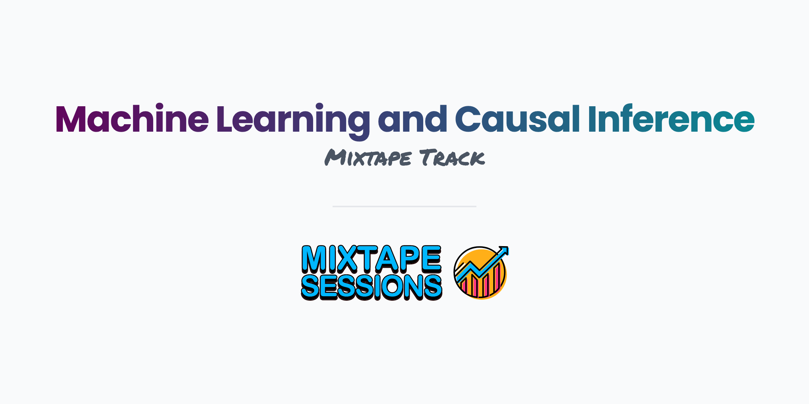

 

Shift-Share Instrumental Variables (SSIV) are used to address endogeneity and selection challenges in many economic settings. This half-day workshop will introduce the basics of SSIV and cover the recent literature on its econometric foundations. Special focus will be paid on the different assumptions underlying the “exogenous shares” and “exogenous shocks” approaches to SSIV identification, and their practical implications. We will also cover a more general class of instrumental variable strategies combining exogenous shocks and non-random exposure. Group programming exercises will be used to illustrate various theoretical concepts in real-world applications.

### Day 1

1. What’s your question? (prediction vs. causality)

2. Standard tools of causal inference
  - gold standard: RCT
  - Multiple Regression

3. ML prediction tools
  - prediction objective
  - bias-variance tradeoff
  - lasso
  - random forest

### Day 2

1. Where does ML prediction fit within causal inference?
  - flexibly adjust for covariates
  - estimate heterogeneous treatment effects

2. Post-Double Selection Lasso
  - Theory
  - Implementation

3. Double Machine Learning
  - Theory
  - Implementation

## Readings

The following is a set of introductory readings for machine learning and causal inference and is in a good potential reading order

[Kleinberg, Ludwig, Mullainathan, and Obermeyer (2015)](https://github.com/Mixtape-Sessions/Machine-Learning/raw/main/Readings/Kleinberg_Ludwig_Mullainathan_Obermeyer_2015.pdf)

[Varian (2014)](https://github.com/Mixtape-Sessions/Machine-Learning/raw/main/Readings/Varian_2014.pdf)

[Mullainathan and Spiess (2017)](https://github.com/Mixtape-Sessions/Machine-Learning/raw/main/Readings/Mullainathan_Spiess_2017.pdf)

[Athey and Imbens 2019)](https://github.com/Mixtape-Sessions/Machine-Learning/raw/main/Readings/Athey_Imbens_2019.pdf)

[Belloni, Chernozhukov, and Hansen (2014)](https://github.com/Mixtape-Sessions/Machine-Learning/raw/main/Readings/Belloni_Chernozhukov_Hansen_2014.pdf)

## Slides

[Day 1](https://github.com/Mixtape-Sessions/Machine-Learning/raw/main/Slides/Day-1.pdf)

[Day 2](https://github.com/Mixtape-Sessions/Machine-Learning/raw/main/Slides/Day-2.pdf)

## Coding Labs

1. [RCT to Regression](https://github.com/Mixtape-Sessions/Shift-Share/blob/main/Labs/python/RCT%20to%20Regression.ipynb)

2. [Predication](https://github.com/Mixtape-Sessions/Shift-Share/blob/main/Labs/python/Prediction.ipynb)

3. [Causal via Predication](https://github.com/Mixtape-Sessions/Shift-Share/blob/main/Labs/python/Causal%20via%20Prediction.ipynb)

